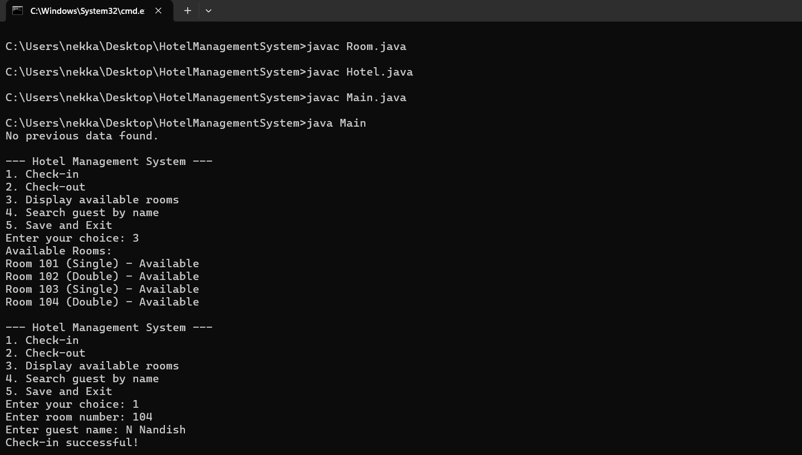

# Hotel Management System (Java)

This is a simple **console-based Hotel Management System** developed using Java.  
The project allows hotel staff to manage room bookings and guest information.

## Features
- Check-in guests
- Check-out guests
- Display available rooms
- Search guest by name
- Save hotel data using file handling

## Technologies Used
- Java
- Object-Oriented Programming (OOP)
- File Handling

## Screenshots

### Main Menu

### Available Rooms

### Check-in

### Search Guest

### Check-out

